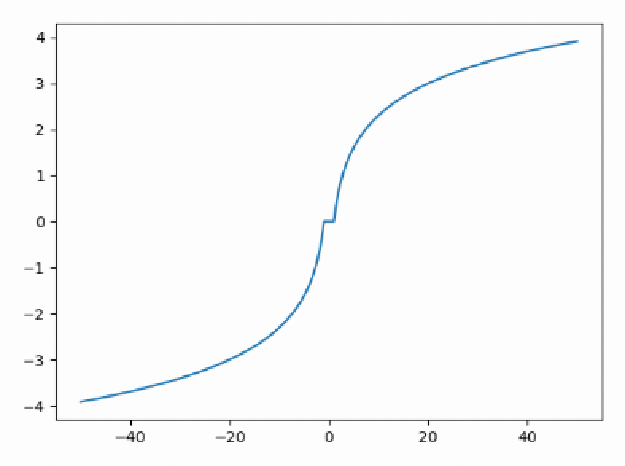

# Section 2 note

## Hacker News Formula

$$ score = \frac{{ups - downs - 1}^{0.8}}{{(age+2)^{gravity}}} \times penalty $$

- gravity = 1.8

------

### References:
- [Hacker News](https://news.ycombinator.com/)
- [How Hakcer News ranking really works](https://www.righto.com/2013/11/how-hacker-news-ranking-really-works.html)

## Reddit Formula

$$ score = sign(ups - downs) \times log(max(1, |ups - downs|)) + \frac{age}{45000} $$

- Graph of the Reddit formula:
`y = np.sign(x) * np.log(np.maximum(1, np.abs(x)))`

------

## Confidence Intervals
### Normal Distribution

$$ 95\\%  CI = \left[ \bar{X} + z_{left} \frac{s}{\sqrt{N}}, \bar{X}+z_{right} \frac{s}{\sqrt{N}} \right] $$
$$ 95\\%  CI = \left[ \bar{X} + 1.96 \frac{s}{\sqrt{N}}, \bar{X}+1.96 \frac{s}{\sqrt{N}} \right] $$

$$ z_{left} = \Phi^{-1}(0.025) $$
$$ z_{right} = \Phi^{-1}(0.975) $$

$$ \Phi \text{= CDF of normal distribution} $$
$$ s = \sqrt{\frac{1}{N} \sum_{i=1}^{N} (X_i - \bar{X})^2} $$

### Bernoulli Distribution
$$ 95\\% CI = \left[ \hat{p} - 1.96 \sqrt{\frac{\hat{p}(1-\hat{p})}{N}}, \hat{p} + 1.96 \sqrt{\frac{\hat{p}(1-\hat{p})}{N}} \right] $$

### Wilson Interval

$$ \frac{\hat{p}+\frac{z^2}{2N}}{1+\frac{z^2}{N}} \pm \frac{z}{1+\frac{z^2}{N}} \sqrt{\frac{\hat{p}(1-\hat{p})}{N} + \frac{z^2}{4N^2}} $$

- Applying to non-binary rating (e.g. 5-star rating):

    | Starts | Negative | Positive | Total |
    |--------|----------|----------|-------|
    | 0      | 0        | 0        | 0     |
    | 1      | 1        | 0        | 1     |
    | 2      | 0.75     | 0.25     | 1     |
    | 3      | 0.5      | 0.5      | 1     |
    | 4      | 0.25     | 0.75     | 1     |
    | 5      | 0        | 1        | 1     |

## Average Score Smoothing

- Plain Average:
$$ \bar{X} = \frac{1}{N} \sum_{i=1}^{N} X_i $$

- Smoothed Average:
$$ r = \frac{\sum_{i=1}^{N} X_i+\lambda \mu_0}{N+\lambda} $$

  - $\lambda$: smoothing factor
  - $\mu_0$: prior mean (e.g. global average)

## Markov Model
### Markov Chain
$$ P(X_{t}|X_{t-1}, X_{t-2}, ..., X_{1}) = P(X_{t}|X_{t-1}) $$

### Transition Probability Matrix
$$ A(i,j) = P(X_{t}=j|X_{t-1}=i) $$

$$ \sum_{j=1}^{M} A(i,j) = \sum_{j=1}^{M} P(X_{t}=j|X_{t-1}=i) = 1 $$

- Reference: [Markov Chains visualization](http://setosa.io/ev/markov-chains/)

$$ p(\text{rainy}|\text{sunny}) = \frac{count(\text{sunny} \rightarrow \text{rainy})}{count(\text{sunny})} $$

### Problem

$$ p(x_1, \cdots, x_T) = p(x_1) \prod_{t=2}^{T} p(x_t|x_{t-1}) $$

- If single 0 probability, the whole probability becomes 0.

#### Add-1 smoothing

$$ p(x_t=j|x_{t-1}=i) = \frac{count(i \rightarrow j)}{count(i)+V} $$

- V: number of states

$$ E(\pi) = \frac{\alpha'}{\alpha'+\beta'} = \frac{\alpha + \left( \sum_{i=1}^{N}X_i \right)}{\alpha + \beta + N} $$

#### Add epsilon smoothing

$$ p(x_t=j|x_{t-1}=i) = \frac{count(i \rightarrow j)+\epsilon}{count(i)+\epsilon V} $$

## State distribution

$$ \pi_t = [p(x_t=1), p(x_t=2), \cdots, p(x_t=M)] $$

### Future state distribution
- Consider there is only two states (e.g. sunny and rainy)

$$
\begin{align}
    p(x_{t+1}=j) & = \sum_{i=1}^{M} p(x_{t+1}=j, x_t=i) \\
                 & = \sum_{i=1}^{M} p(x_{t+1}=j|x_t=i)p(x_t=i) \\
                 & = \sum_{i=1}^{M} A(i,j) \pi_t(i) \\
                 & = \pi_{t+1}(j)
\end{align}
$$

- As a matrix form:

$$ \pi_{t+1}(j) = \sum_{i=1}^{M} A(i,j) \pi_t(i) $$
$$ \pi_{t+1} = \pi_t A $$

- After k steps:

$$ \pi_{t+2} = \pi_{t} AA = \pi_{t} A^2 $$
$$ \pi_{t+k} = \pi_t A^k $$

